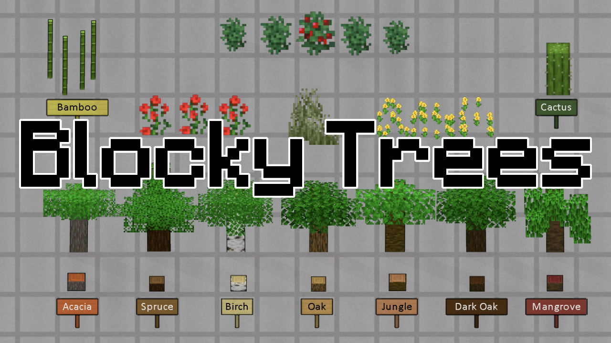

# Blocky Trees

Purely cosmetic mod that replaces vanilla trees with the blocky ones from Minecraft.
Grass and some flowers is also retextured.
No new wood types or any other new things here.

## Complete list of changed things

1. Bamboo tree
1. Berry plant
1. Birch tree
1. Brambles
1. BushA
1. Dandelion
1. Saguaro Cactus - renamed to just Cactus
1. Drago tree - it's now Acacia :)
1. Grass
1. Oak tree
1. Palm tree -> Jungle tree
1. Pine tree -> Spruce tree
1. Poplar tree -> Dark oak tree
1. Rose
1. Tall grass
1. Willow tree -> Mangrove tree
1. Modded trees now leave modded stumps when chopped

## You may also like...

https://github.com/zed-0xff/RW-BlockyTrees

## Support me

 or [Patreon](https://www.patreon.com/zed_0xff)
